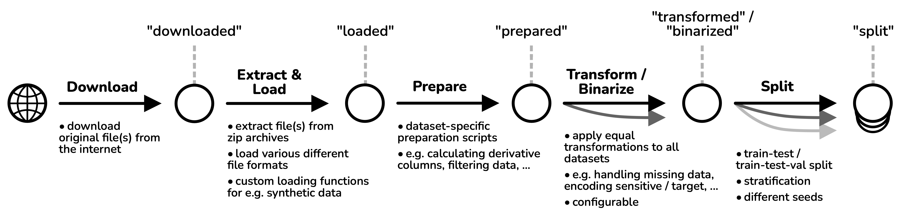

# Getting Started

This guide covers the basic usage of the FairML Datasets package to help you get started quickly.

## Basic Concepts

FairML Datasets is designed around a few core concepts:

- **Dataset**: A single dataset with detailed annotations regarding its usage and how to load / prepare it.
- **Scenario**: A dataset paired with a specific selection of sensitive attributes.
- **Collection**: A prespecified list of Scenarios / Datasets.
- **Datasets**: A special collection which includes all Datasets (with one Scenario per Dataset).
- **Corpus**: A special collection which includes all Scenarios.

## Listing Available Datasets

To get started, let's first see what datasets are available:

```python
from fairground import Datasets

# Load all available datasets
datasets = Datasets()

# Print the available dataset IDs
print(f"Number of datasets: {len(datasets)}")
print("Available datasets:")
for dataset in datasets:
    print(f"- {dataset.dataset_id}")
```

## Loading a Dataset

Once you've identified a dataset you want to work with, you can load it using either method:

```python
from fairground import Dataset, Datasets

# Method 1: Access directly using Dataset.from_id
dataset = Dataset.from_id("folktables_acsincome_small")

# Method 2: Access through the Datasets collection
datasets = Datasets()
dataset = datasets["folktables_acsincome_small"]

# Load the dataset
df = dataset.load()

# Print basic information
print(f"Dataset shape: {df.shape}")
print(f"Column names: {df.columns.tolist()}")
print(f"Sensitive columns: {dataset.sensitive_columns}")
print(f"Target column: {dataset.get_target_column()}")
```

## Processing Pipeline



The Python Package supports and implements the different steps of the data preprocessing pipeline outlined above. You can access data after each processing step.

```python
from fairground import Dataset

dataset = Dataset.from_id("folktables_acsincome_small")

# Method 1: Directly load data at a certain stage
df_prep = dataset.load(stage="prepared")
df_transformed = dataset.load(stage="transformed")
df_binarized = dataset.load(stage="binarized")

# Method 2: Apply processing steps one by one
# This grants more flexibility to modify behaviour
df_prep = dataset.load() # default stage = "prepared"
df_transformed, info = dataset.transform(df_prep)
df_train, df_test, df_val = dataset.train_test_val_split(df_transformed)
```

## Scenarios

Scenarios behave just like Datasets, but can differ in their selection of sensitive / protected attributes.

You can create your own Scenarios by specifying a Dataset and sensitive attributes.

```python
from fairground import Scenario

scenario = Scenario(
    dataset="folktables_acsincome_small",
    sensitive_columns=["RAC1P"]
)

df = scenario.load()
```

## Collections

Collections contain a prespecified selection of Scenarios that maximizes their variability (see the paper for more information).

You can easily iterate over collections in a Python loop

```python
from fairground.collections import DecorrelatedSmall

for scenario in DecorrelatedSmall():
    df = scenario.load()
```

A list of collections is available in the [API reference](../api/collections.md) and collections are described in detail in the paper.
